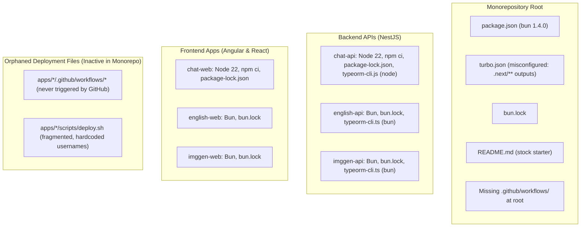

# Monorepo Consolidation Plan

## 1. Current State & Gap Analysis



### Key Findings
1. **Runtime Inconsistency:** `english-api`, `english-web`, `imggen-api`, and `imggen-web` already use **Bun** and contain `bun.lock`. However, `chat-api` and `chat-web` still rely on **Node.js 22**, `npm ci`, and `package-lock.json`.
2. **TypeORM CLI Inconsistency:** In `chat-api`, `typeorm-cli.js` and scripts/migration-run.js invoke `node` and `npm run`, whereas `english-api` and `imggen-api` compile a TypeScript wrapper (src/typeorm-cli.ts) to `dist/typeorm-cli.js` executed directly by Bun.
3. **Inactive Deployment Workflows:** GitHub Actions only triggers workflows residing in the repository's root `.github/workflows/`. All 6 workflows located in `apps/*/.github/workflows/` are orphaned.
4. **Turborepo Misconfiguration:** `turbo.json` retains create-turbo default outputs (`.next/**`). None of the 6 apps use Next.js; all apps build into `dist/**`.
5. **Environment Variable Duplication & Collisions:**
   - Same secret stored under different names across apps (e.g. `DOCKERHUB_ACCESS_TOKEN` vs `DOCKERHUB_TOKEN`, `S3_ACCESS_KEY` vs `AWS_ACCESS_KEY_ID`).
   - App-specific settings using identical variable names that collide at repository level (e.g. `DB_NAME`, `FRONTEND_URL`, `AUTH0_AUDIENCE`).

---

## 2. Phase-by-Phase Plan

### Phase 1: Migrate `chat-api` and `chat-web` to Bun

#### 1.1 `chat-api` Bun Migration
- **Containerization (`Dockerfile`):**
  - Switch build & production stages from `node:22-alpine` to `oven/bun:1.4-alpine`.
  - Replace `npm ci` with `bun install --frozen-lockfile` (and `bun install --production`).
  - Change build command to `bun run build`.
  - Change runtime CMD from `["node", "--input-type=module", "dist/main.js"]` to `["bun", "dist/main.js"]`.
- **TypeORM Migrations with Bun:**
  - Standardize migration architecture to match `english-api`:
    - Move `typeorm-cli.js` to `apps/chat-api/src/typeorm-cli.ts` (using `child_process.spawnSync('bun', [typeormCliPath, command, '-d', datasourcePath])`).
    - Nest CLI compiler (`swc`) will compile it into `dist/typeorm-cli.js`.
  - Update `package.json` scripts:
    - `"start:prod"`: `"bun dist/main"`
    - `"migration:run"`: `"bun run typeorm migration:run -d src/config/db/db.datasource.ts"`
    - `"migration:revert"`: `"bun run typeorm migration:revert -d src/config/db/db.datasource.ts"`
    - `"migration:show"`: `"bun run typeorm migration:show -d src/config/db/db.datasource.ts"`
    - `"migration:run:prod"`: `"bun dist/typeorm-cli.js migration:run"`
    - `"migration:revert:prod"`: `"bun dist/typeorm-cli.js migration:revert"`
    - `"migration:show:prod"`: `"bun dist/typeorm-cli.js migration:show"`
  - Refactor `migration-run.js`:
    - Replace `npm run typeorm` execution with `bun run typeorm`.
    - Support Bun argument parsing for `--name=<Name>` instead of relying solely on `process.env.npm_config_name`.
- **Lockfile & Dependencies:**
  - Remove `package-lock.json` and register dependencies into root `bun.lock`.

#### 1.2 `chat-web` Bun Migration
- **Containerization (`Dockerfile`):**
  - Change build stage base image from `node:22-alpine` to `oven/bun:1.4-alpine`.
  - Replace `npm ci` with `bun install --frozen-lockfile`.
  - Replace `npm run build --prod` with `bun run build`.
  - Keep Nginx unprivileged production runtime serving `/app/dist/myaichat/browser`.
- **Lockfile & Dependencies:**
  - Remove `package-lock.json` and ensure Angular CLI (`ng build`, `vitest`) runs via Bun workspaces.

---

### Phase 2: Environment Variables Analysis & De-duplication

To prevent duplicate secrets and avoid namespace collisions across applications on the shared server, consolidate environment variables as follows:

| Category | Current Names Across Apps | Problem / Conflict | Standardized Monorepo Convention |
| :--- | :--- | :--- | :--- |
| **Docker Hub Token** | `DOCKERHUB_ACCESS_TOKEN` (`chat-*`)<br>`DOCKERHUB_TOKEN` (`english-*`, `imggen-*`) | Same secret duplicated under two names in GitHub Secrets | **`DOCKERHUB_TOKEN`** (Repo Secret) |
| **Docker Hub Username** | `DOCKERHUB_USERNAME` (`vars`), hardcoded `luisghtz` in scripts | Fragile hardcoded strings in deploy scripts | **`DOCKERHUB_USERNAME`** (Repo Variable) |
| **AWS / S3 Storage** | `S3_ACCESS_KEY`, `S3_SECRET_KEY`, `S3_BUCKET_NAME` (`chat-api`)<br>`AWS_ACCESS_KEY_ID`, `AWS_SECRET_ACCESS_KEY`, `AWS_S3_BUCKET`, `AWS_S3_REGION` (`imggen-api`) | Redundant credentials for AWS services; non-standard naming in `chat-api` | **`AWS_ACCESS_KEY_ID`**, **`AWS_SECRET_ACCESS_KEY`**, **`AWS_REGION`** (Repo Secrets)<br>App buckets: `CHAT_S3_BUCKET`, `IMGGEN_S3_BUCKET` |
| **GitHub OAuth** | `GH_CLIENT_ID`, `GH_CLIENT_SECRET`, `CALLBACK_URL` (`chat-api` workflow) | Workflow names differ from `env.schema.ts` requirements | **`GITHUB_CLIENT_ID`**, **`GITHUB_CLIENT_SECRET`**, **`GITHUB_CALLBACK_URL`** |
| **Auth0 Tenant** | `AUTH0_DOMAIN` (`api` apps)<br>`NG_APP_AUTH0_DOMAIN` (`english-web`)<br>`VITE_AUTH0_DOMAIN` (`imggen-web`) | Same tenant domain duplicated 3 times for build args | **`AUTH0_DOMAIN`** (Repo Secret/Variable) — injected into build args as needed |
| **Auth0 Audience** | `AUTH0_AUDIENCE` (`english-api` & `imggen-api`) | **Collision risk:** Both APIs expect `AUTH0_AUDIENCE`, but have different API identifiers | **`ENGLISH_AUTH0_AUDIENCE`**, **`IMGGEN_AUTH0_AUDIENCE`** |
| **Auth0 Client IDs** | `NG_APP_AUTH0_CLIENT_ID` (`english-web`)<br>`VITE_AUTH0_CLIENT_ID` (`imggen-web`) | Different client applications | **`ENGLISH_AUTH0_CLIENT_ID`**, **`IMGGEN_AUTH0_CLIENT_ID`** |
| **Database Host & Credentials** | `DB_HOST`, `DB_PORT`, `DB_USERNAME`, `DB_PASSWORD` (all APIs) | Shared PostgreSQL instance on `--network dbs` | Shared Repo Secrets: **`DB_HOST`**, **`DB_PORT`**, **`DB_USERNAME`**, **`DB_PASSWORD`** |
| **Database Name** | `DB_NAME` (`myaichat`, `myaienglishapi`, `myaiimg`) | **Collision risk:** Each API must connect to its own database | **`CHAT_DB_NAME`** (`myaichat`)<br>**`ENGLISH_DB_NAME`** (`myaienglishapi`)<br>**`IMGGEN_DB_NAME`** (`myaiimg`) |
| **Frontend URLs** | `FRONTEND_URL` (`chat-api` & `english-api`)<br>`VITE_API_URL` (`imggen-web`) | **Collision risk:** Point to different frontend origins | **`CHAT_FRONTEND_URL`** (port 3051)<br>**`ENGLISH_FRONTEND_URL`** (port 3053)<br>**`IMGGEN_FRONTEND_URL`** (port 3054)<br>**`IMGGEN_API_URL`** (port 3004) |
| **Environment Mode** | `NODE_ENV` (vars in chat, hardcoded in english, secret in imggen) | Inconsistent handling of non-sensitive setting | Default to **`NODE_ENV: production`** across all deploy configs |

---

### Phase 3: Centralize Deployment Files to Monorepo Root

```
myaiapps/
├── .github/
│   └── workflows/
│       ├── deploy.yml               <-- Central CI/CD pipeline (filtered & cached)
│       └── ci.yml                   <-- PR / commit validation (build, test, lint)
├── deploy/
│   ├── chat-api.sh                  <-- Dedicated remote deploy script
│   ├── chat-web.sh
│   ├── english-api.sh
│   ├── english-web.sh
│   ├── imggen-api.sh
│   └── imggen-web.sh
```

#### 3.1 Centralized Deploy Scripts (`deploy/*.sh`)
- Move and clean deployment logic from `apps/*/scripts/deploy.sh` into root `deploy/`.
- Replace hardcoded Docker Hub usernames (`luisghtz`) with dynamic `${DOCKERHUB_USER}`.
- Standardize container ports and network configurations:
  - **`chat-api`**: `3001:3000` (Networks: `dbs`, `redis`)
  - **`english-api`**: `3003:3000` (Network: `dbs`)
  - **`imggen-api`**: `3004:3000` (Network: `dbs`)
  - **`chat-web`**: `3051:80`
  - **`english-web`**: `3053:80`
  - **`imggen-web`**: `3054:80`
- Remove all orphaned `apps/*/scripts/deploy.sh` and `apps/*/.github/`.

#### 3.2 Root GitHub Actions Workflow (`.github/workflows/deploy.yml`)
- **Avoid deployment flow on unchanged apps:**
  - Utilize path-based filtering (or Turborepo's `--filter=...[HEAD^1]` / `dorny/paths-filter`) to detect which specific apps were touched by the push.
  - A change detection job outputs boolean flags for each app (`chat-api`, `chat-web`, `english-api`, `english-web`, `imggen-api`, `imggen-web`).
  - Deploy jobs execute conditionally: `if: needs.changes.outputs.<app> == 'true'`.
  - Manual deployment support: `workflow_dispatch` with an input to select an individual app or `all`.
- **Approach Turborepo Cache & Docker Buildx Cache:**
  - Run `actions/cache` on `.turbo` and `bun` store.
  - Build step invokes `turbo run build --filter=...[HEAD^1]` to leverage Turborepo build caching.
  - Docker builds use `docker/setup-buildx-action` with GitHub Actions layer cache:
    `cache-from: type=gha,scope=<app>` and `cache-to: type=gha,mode=max,scope=<app>`.
- **Remote SSH Deployment:**
  - Executes corresponding `deploy/<app>.sh` on the target server via `appleboy/ssh-action`.

---

### Phase 4: Turborepo Configuration & Tooling Optimization

Update `turbo.json`:
```json
{
  "$schema": "https://turborepo.dev/schema.json",
  "ui": "tui",
  "tasks": {
    "build": {
      "dependsOn": ["^build"],
      "inputs": ["$TURBO_DEFAULT$", ".env*", "tsconfig*.json"],
      "outputs": ["dist/**"]
    },
    "test": {
      "dependsOn": ["^build"],
      "inputs": ["$TURBO_DEFAULT$"],
      "outputs": ["coverage/**"]
    },
    "lint": {
      "dependsOn": ["^lint"]
    },
    "check-types": {
      "dependsOn": ["^check-types"]
    },
    "dev": {
      "cache": false,
      "persistent": true
    }
  }
}
```

Add root helper scripts to `package.json`:
- `"test"`: `"turbo run test"`
- `"build"`: `"turbo run build"`
- `"deploy"`: `"turbo run build --affected"`

---

### Phase 5: Root `README.md` Modernization

Replace the placeholder starter content with production-grade documentation:
1. **Workspace Architecture:** Diagram of the monorepo, technology stack per app, and directory conventions.
2. **Applications Directory:** Ports, database schemas, frameworks, and responsibilities for all 6 apps.
3. **Getting Started:** Bun installation, workspace bootstrapping (`bun install`), and running individual/all apps.
4. **Development & Turborepo Workflows:** Running tasks with filters (e.g. `turbo run dev --filter=@myaiapps/chat-api`), running tests, and managing cache.
5. **Database & TypeORM Migration Guide:** Commands for generating, showing, and running migrations in dev and production.
6. **Deployment & CI/CD Documentation:** Pipeline flow, change detection logic, server architecture, Docker networking, and deployment scripts.
7. **Complete Environment Variables Reference:** Exhaustive reference table detailing all repository secrets and variables.

---

## 3. Sub-Agent Delegation Plan

Following the Orchestrator boundaries, tasks will be delegated to domain-specific agents:

### Step 1: NestJS Specialist Agent
* **Domain:** `chat-api`
* **Tasks:**
  1. Create `src/typeorm-cli.ts` matching the Bun implementation in `english-api`.
  2. Update `package.json` scripts (`start:prod`, `migration:*`, `typeorm`).
  3. Update `migration-run.js` for Bun execution and CLI arguments.
  4. Update `Dockerfile` to `oven/bun:1.4-alpine`.
  5. Remove `package-lock.json` and `typeorm-cli.js`.

### Step 2: Angular Specialist Agent
* **Domain:** `chat-web`
* **Tasks:**
  1. Update `Dockerfile` to `oven/bun:1.4-alpine` for build stage.
  2. Verify build commands with Bun.
  3. Remove `package-lock.json`.

### Step 3: Developer / DevOps Specialist Agent
* **Domain:** Root deployment & Turborepo configuration
* **Tasks:**
  1. Update `turbo.json` with correct outputs (`dist/**`) and task pipelines (`test`).
  2. Move and refactor deploy scripts to `deploy/*.sh` with `${DOCKERHUB_USER}` and standardized ports/networks.
  3. Remove orphaned `apps/*/.github` and `apps/*/scripts/deploy.sh`.
  4. Create `.github/workflows/deploy.yml` with path filtering, Turborepo caching, Docker buildx cache, and conditional SSH deployments.
  5. Write the comprehensive root `README.md`.

### Step 4: Testing & Verification Agent
* **Domain:** Verification & Validation
* **Tasks:**
  1. Execute `bun install` at the workspace root to ensure lockfile resolution.
  2. Validate compilation across all projects with `turbo run build`.
  3. Validate type-checking with `turbo run check-types`.
  4. Confirm zero broken migration references or missing dependencies.

---

Would you like to proceed with this plan? Once approved, we will begin dispatching Phase 1 to the respective agents.

Created 3 todos